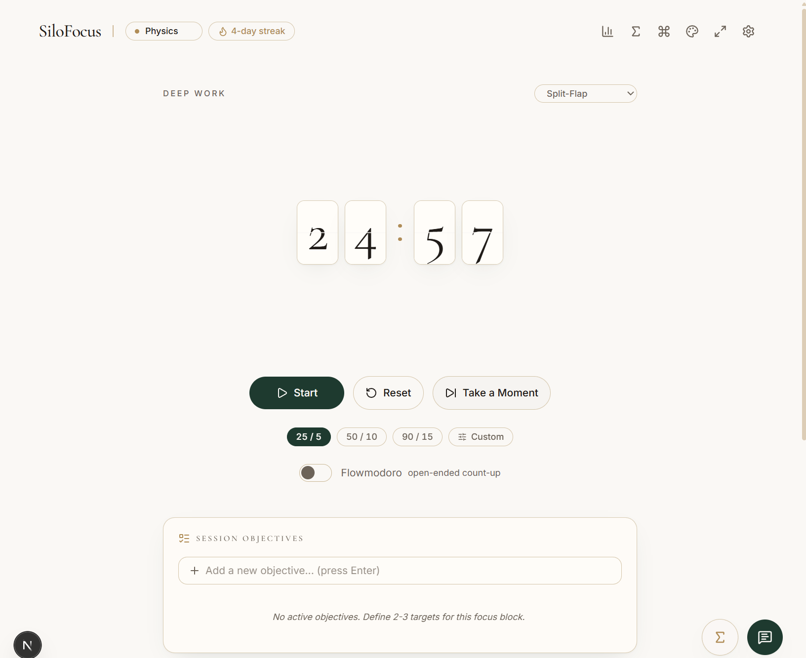
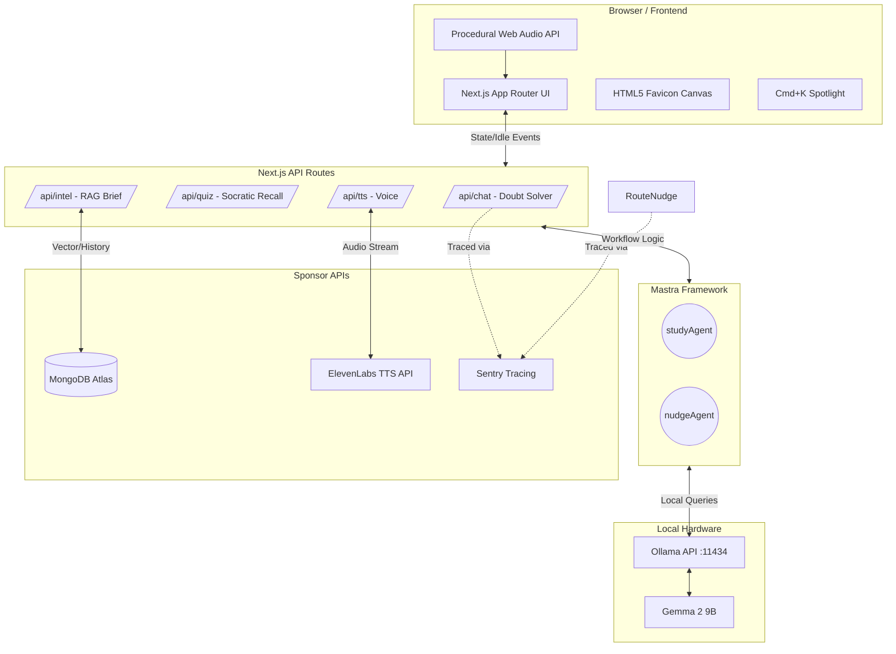
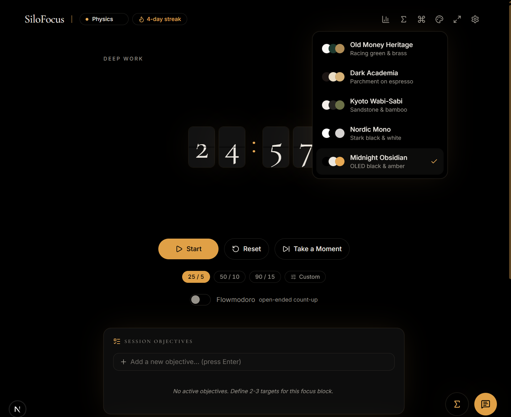
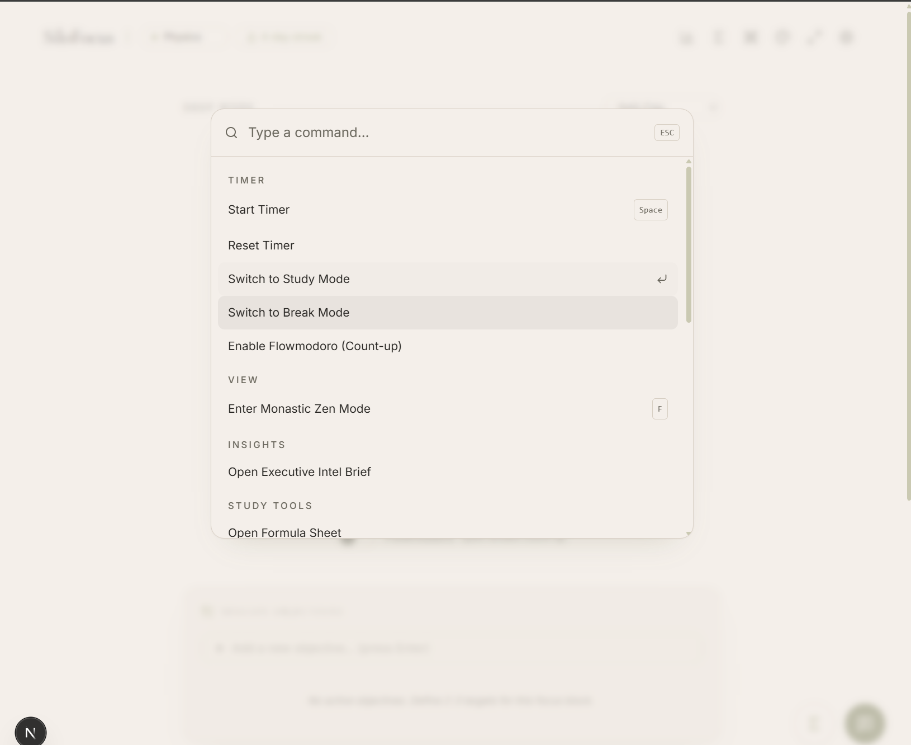
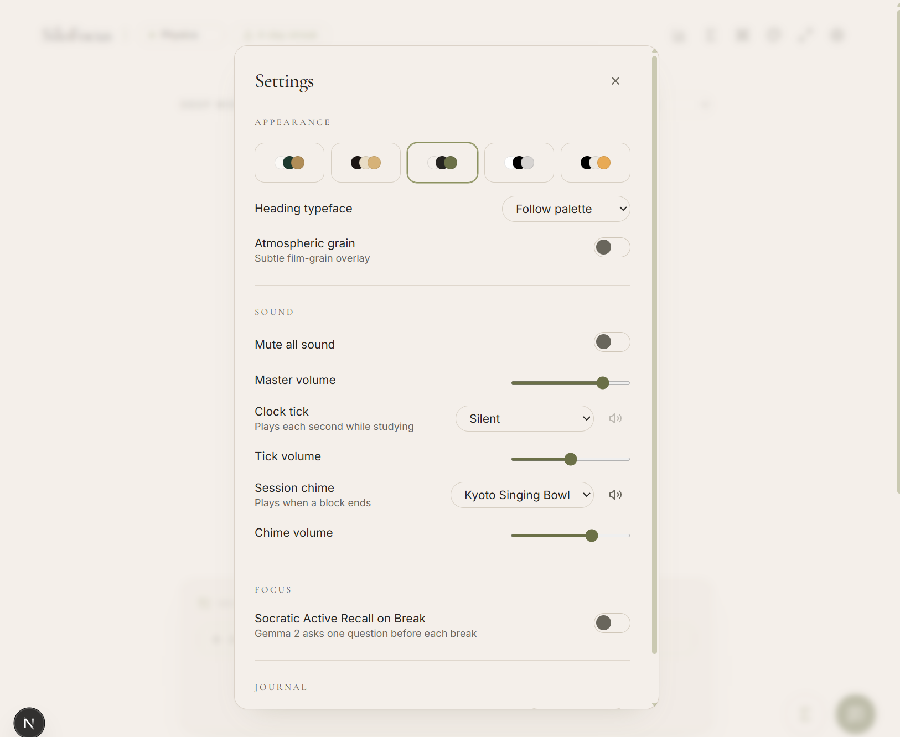
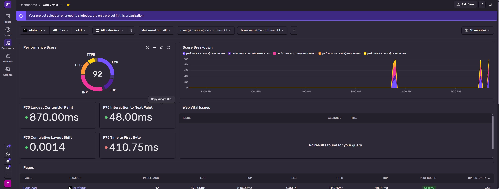

# 🏛️ SiloFocus

> A privacy-first, zero-runtime-cost AI study companion and kinetic timepiece. Built with local open-weight models, procedural audio, and fluid kinetic UI.

[](https://hacktoberfest.com)
[](https://nextjs.org)
[](https://mastra.ai)
[](https://ollama.com)
[](https://opensource.org/licenses/MIT)


*Above: SiloFocus running the Vintage Split-Flap topology in 'Old Money Heritage' mode.*

**SiloFocus** was built for the Major League Hacking (MLH) Hacktoberfest 2026 "Build for a Friend" challenge. Designed originally to help a student conquer 12th Board Exam burnout, it has evolved into a hyper-customizable, universally adaptable focus environment. 

By running **Gemma 2 9B locally via Ollama**, SiloFocus delivers elite STEM tutoring and active recall quizzes with absolute data privacy and zero API costs.

---

## 🧠 System Architecture

GitHub natively renders the flowchart below. It details the flow of state, audio, and agentic LLM orchestration across the local hardware and cloud integrations.



---

## ✨ The 5 Pillars of Engineering

### I. Kinetic Timepiece Topologies
SiloFocus features a fluid kinetic animation engine featuring 60fps hardware-accelerated digit rolling (`tabular-nums` + `translate3d`).

| Topology | Description |
| :--- | :--- |
| **Editorial Radial** | Serif numerical display encased in a continuous SVG progress ring. |
| **Vintage Split-Flap** | Mechanical flip cards using CSS 3D perspective (`rotateX(-180deg)`). |
| **Bauhaus Analog** | Clean minimalist dial with second and minute sweep hands. |
| **Linear Pillar** | Mercury-column vertical progress bar with GPU-accelerated scaling. |

**Flowmodoro Mode:** Open-ended count-up stopwatch with a glowing pulse state for deep work sessions.


*Above: Toggling between the 5 curated Haute Aesthetics.*

### II. Procedural Web Audio Engine
No MP3s. No loading lag. All audio is procedurally synthesized in the browser via `AudioContext`.
* **Mechanical Ticks:** Grandfather Clock (112Hz dual pendulum), Pocket Watch (high-pass burst escapement), and Soft Tactile micro-clicks.
* **Resonant Chimes:** Kyoto Singing Bowl (dual harmonic oscillators with a 4.5s decay), Shinkansen Chimes, and Brass Desk Bells.
* **Ambient Soundscapes:** Procedural Brown Noise, Pink Noise, and generative Rain simulations.

### III. Haute Aesthetic & Zen Mode
* **5 Curated Palettes:** Old Money Heritage, Dark Academia, Kyoto Wabi-Sabi, Nordic Mono, and Midnight Obsidian.
* **Atmospheric Grain:** A toggleable full-viewport SVG `<feTurbulence>` noise film.
* **Monastic Zen Mode (F):** Smoothly fades out all peripheral UI, centering the active timepiece in pure focus space.


*Above: Command tool showing instant navigation perfectly rendered menu.*

### IV. Multimodal AI & Integrations
* **Voice Dictation & TTS:** Hands-free speech-to-text input, paired with ElevenLabs for crystal clear audio playback (with native browser fallback).
* **Gemma 2 Socratic Pop-Quiz:** Intercepts break transitions to prompt the student with one sharp, conceptual recall question.
* **Executive Intel Brief:** Aggregates MongoDB study metrics and prompts Gemma 2 to draft an executive performance analysis.


*Above: Displaying the app's settings menu for customization.*

### V. Ergonomics & Productivity
* **Notion-Style Task Checklist:** Inline inputs, animated strikethroughs, and `localStorage` persistence.
* **Spotlight Command Palette (Cmd+K):** Keyboard-first navigation for all core actions.
* **Dynamic Canvas Favicon:** A real-time HTML5 canvas draws the live progress ring directly onto the browser tab.
* **Markdown Journal Exporter:** One-click compilation of daily focus blocks, tasks, and doubts into a downloadable `.md` file.


*Above: Sentry dashboard tracing the sub-second data of the local Gemma 2 model.*

---

## 🛠️ Tech Stack & Hacktoberfest 2026 Sponsors

This project stacks technologies from 6 major Hacktoberfest 2026 sponsors:

| Sponsor | Integration Role |
| :--- | :--- |
| **Gemma** | Local open-weight inference (`gemma2:9b`) via Ollama. |
| **Mastra** | Agentic state orchestration (`studyAgent` & `nudgeAgent`). |
| **ElevenLabs** | Crystal-clear Text-to-Speech streaming API. |
| **MongoDB Atlas** | Persistent memory storage for session history and RAG analytics. |
| **Sentry** | Telemetry and exact millisecond latency tracing of local LLM endpoints. |
| **Render** | Deployment infrastructure for the Next.js frontend bridge. |

**Core Frameworks:** Next.js 14+ (App Router), TypeScript, Tailwind CSS, Web Audio API, Web Speech API.

---

## 🚀 Quick Start (Run Locally)

**1. Start Local AI Engine:**
Download Ollama and run the model in your terminal:
```bash
ollama run gemma2:9b
```

**2. Clone & Install:**
```bash
git clone [https://github.com/your-username/SiloFocus.git](https://github.com/your-username/SiloFocus.git)
cd SiloFocus
npm install
```

**3. Configure Environment:**
Rename `.env.example` to `.env.local` and add your keys (MongoDB, ElevenLabs, Sentry).

**4. Seed Database & Run:**
```bash
npm run seed
npm run dev
```

Open `http://localhost:3000`.

> *Built with excessive amounts of coffee for Hacktoberfest 2026.*